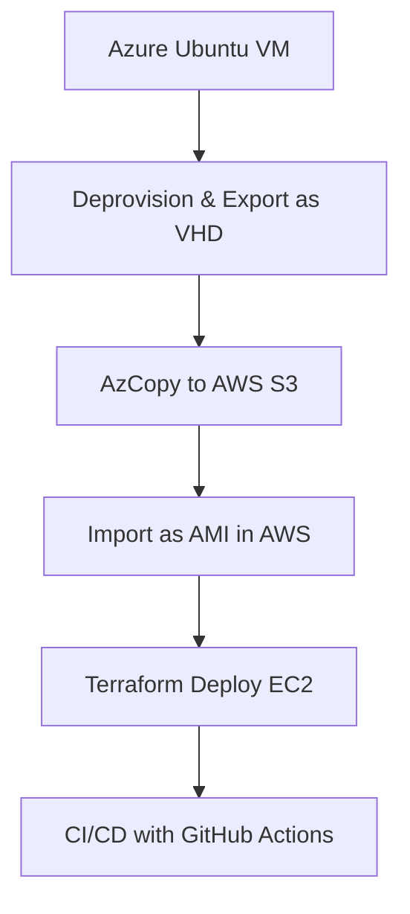

# 🚀 Azure to AWS Ubuntu VM Migration (Using VHD & Terraform)

[](LICENSE)
[](https://www.terraform.io/)

This project demonstrates how to migrate an Ubuntu VM from **Microsoft Azure** to **AWS EC2**, using snapshot-based export, AzCopy, `aws ec2 import-image`, and deploying the final AMI using **Terraform**.

> 💼 Designed as a real-world DevOps migration exercise for startups and cloud professionals.

---

## 🧰 Tools & Technologies Used

- 🧪 Azure CLI  
- 🚀 AzCopy  
- ☁️ AWS CLI  
- 🏗 Terraform (IaC)

---

## 📁 Project Structure

| Folder         | Contents                                              |
|----------------|-------------------------------------------------------|
| `azure/`       | Scripts for preparing and exporting Azure VM          |
| `aws/`         | Scripts for importing VHD to AWS & defining AMI       |
| `terraform/`   | Terraform code to deploy EC2 instance from AMI        |
| `docs/`        | Step-by-step documentation (screenshots, diagrams)    |
| `.env.sample`  | Environment variable template                         |

---

## 🔁 Full Migration Workflow

1. ✅ **Deprovision Azure VM** using `waagent`  
2. ☁️ **Export VM as VHD** to Azure Blob Storage  
3. 🚚 **Copy VHD to AWS S3** using AzCopy  
4. 📥 **Register AMI** using `aws ec2 import-image`  
5. ⚙️ **Deploy EC2 instance** via Terraform  

---

## 📦 Quickstart

### 1. Clone the Repository

```bash
git clone https://github.com/your-username/azure-to-aws-vm-migration.git
cd azure-to-aws-vm-migration
```

### 2. Configure Secrets

Create your `.env` file:

```bash
cp .env.sample .env
```

Then edit `.env` with your:
- AWS credentials
- Bucket and key names
- Terraform variables

### 3. Provision Infrastructure

```bash
cd terraform
terraform init
terraform plan
terraform apply
```

> Your EC2 instance will be created from the imported AMI.

---

## 📈 Migration Diagram



---

## ✨ Why This Project

- 🔄 Reproducible Cloud Migration Example
- 🧱 GitOps style deployment with IaC
- ✅ End-to-end automation from Azure to AWS
- 💡 Helpful for DevOps engineers, architects, startups

---

## 👨‍💻 Author

**Shashank Tijare**  
DevOps Engineer | Cloud Infra | Automation Enthusiast  
🔗 [LinkedIn](https://www.linkedin.com/in/shashank-tijare-75783314b/)

---

## 📄 License

This project is licensed under the **MIT License**.  
Feel free to fork and improve it.

